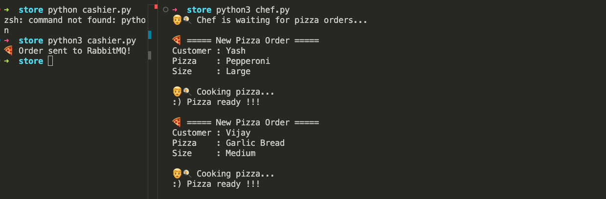
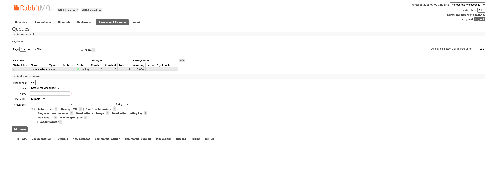

# 🍕 Pizza Shop — My Notes

A tiny project to learn RabbitMQ. It copies how a real pizza shop works:
a **cashier** takes the order, drops it in a queue, and a **chef** picks it up and cooks it.

## The idea in one line

The cashier and chef never talk to each other directly. They only talk to a
middle box called **RabbitMQ**. The cashier puts orders in, the chef takes them out.

```
Cashier  ──►  RabbitMQ (queue)  ──►  Chef
(sends)         (holds orders)       (cooks)
```

## The pieces

| File | What it is | What it does |
|------|-----------|--------------|
| `store/cashier.py` | Producer (sender) | Creates one pizza order and sends it into the queue. |
| `store/chef.py` | Consumer (receiver) | Waits for orders, cooks each one, then confirms it's done. |
| `docker-compose.yml` | Setup | Starts RabbitMQ on my machine. |
| `desc.md` | Flow diagram | Picture of the full order journey. |

## How it works, step by step

1. **Cashier** builds an order (customer name, pizza, size) and sends it to a queue named `pizza-orders`.
2. **RabbitMQ** holds the order safely until a chef is free. Even if the chef is busy or offline, the order waits — it isn't lost.
3. **Chef** takes the order, prints it, and "cooks" it (a fake 5-second wait).
4. When done, the chef sends an **ACK** ("I finished this one").
5. Only after the ACK does RabbitMQ delete the order from the queue.

## The one thing worth remembering: ACK

RabbitMQ does **not** delete an order the moment it hands it to the chef.
It waits for the chef to say "done" (the ACK).

- If the chef crashes *before* saying done → RabbitMQ keeps the order and gives it to another chef.
- This means **no order ever gets lost**, even if something breaks mid-cook.

## How to run it

1. Start RabbitMQ:
   ```
   docker compose up -d
   ```
   Dashboard: http://localhost:15672  (login: `guest` / `guest`)

2. Start the chef (he waits for orders):
   ```
   python store/chef.py
   ```

3. In another terminal, send an order:
   ```
   python store/cashier.py
   ```

The chef should print the order and cook it.

## What it looks like when running

**Terminal — cashier sends orders, chef cooks them:**



**RabbitMQ dashboard — the `pizza-orders` queue holding messages:**



## Why this matters (the real lesson)

This is the **message queue** pattern. In real apps you use it so that:
- A slow job (cooking) doesn't make the customer wait at the counter.
- Work piles up safely if the workers are busy.
- You can add more chefs (workers) later to go faster.
